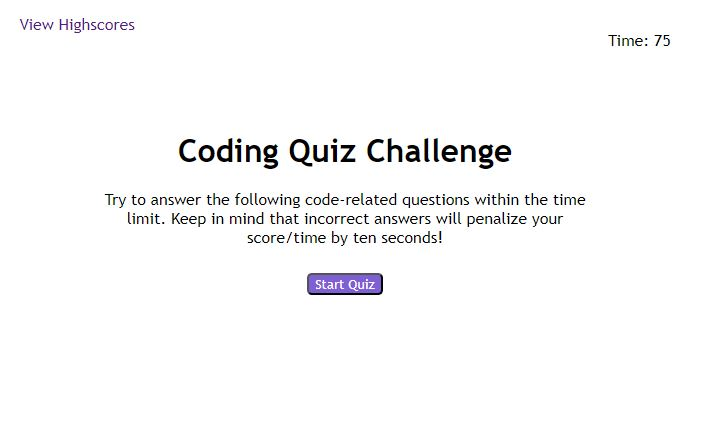

# 04 Web APIs: Code Quiz Assignment Completion

Student: Ryan Moises

## Objective

Text

## User Story

```
AS A coding boot camp student
I WANT to take a timed quiz on JavaScript fundamentals that stores high scores
SO THAT I can gauge my progress compared to my peers
```

## Acceptance Criteria

```
GIVEN I am taking a code quiz
WHEN I click the start button
THEN a timer starts and I am presented with a question
WHEN I answer a question
THEN I am presented with another question
WHEN I answer a question incorrectly
THEN time is subtracted from the clock
WHEN all questions are answered or the timer reaches 0
THEN the game is over
WHEN the game is over
THEN I can save my initials and my score
```

## URLs and Images

The following link is the student's URL to the completed assignment:
(https://ryanmoises5.github.io/Coding-Quiz-RMwk4/)

The following link is the Github repository where the associated files are located:
(https://github.com/RyanMoises5/Coding-Quiz-RMwk4)



---

Student: Ryan Moises
